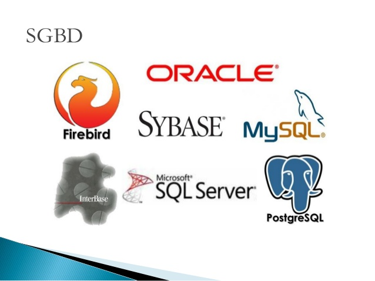
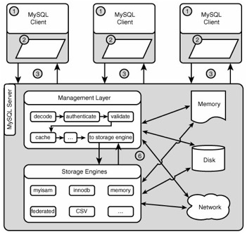
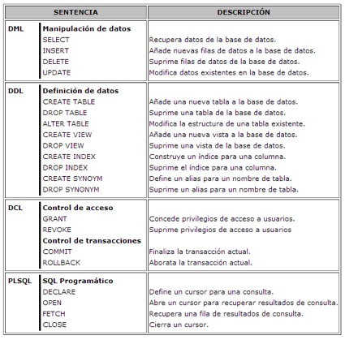
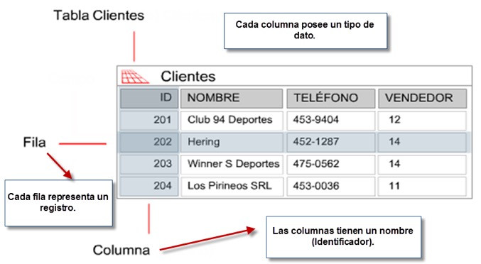

= SQL-Tutorial

Una pequeña introduccion a conceptos sobre SQL y bases de datos con algunos ejemplos. Algunos conceptos o definiciones pueden ser especificas de MySQL pero se pueden extrapolar a otros motores de base de datos.

== ¿Que es una base de datos?

* Una base de datos o banco de datos es un conjunto de datos pertenecientes a un mismo contexto y almacenados sistemáticamente para su posterior uso. 

* Una biblioteca puede considerarse una base de datos compuesta en su mayoría por documentos y textos impresos en papel e indexados para su consulta. 

* Actualmente, y debido al desarrollo tecnológico de campos como la informática y la electrónica, la mayoría de las bases de datos están en formato digital (electrónico), y por ende se ha desarrollado y se ofrece un amplio rango de soluciones al problema del almacenamiento de datos.

== Distintos DBMS

* Algunas de los mas comunes son Oracle, MySQL, SQL Server, PostgreSQL, Firebird, MariaDB, SQL Lite.

*SGBD (Sistema de gestión de bases de datos) = DBMS (Database Management System)*

== ¿Que es MySQL?

MySQL es un sistema de gestión de bases de datos relacional, multihilo y multiusuario.

== Unix Daemons/Windows Services

Un demonio o servicio es un tipo especial de proceso no interactivo, es decir, que se ejecuta en segundo plano en lugar de ser controlado directamente por el usuario. Este tipo de programas se ejecutan de forma continua (infinita).

== Arquitectura Cliente/Servidor

* Servidor: Se encarga de recoger, interpretar y ejecutar todas las peticiones de los usuarios de la base de datos.

* Cliente: Es la parte con la que trabajarán directamente los usuarios.

== Conectividad Cliente/Servidor

* ODBC (Open Database Connectivity): Es un API standard para comunicarse con cualquier base de datos.
* ADO: Es el API standard de .NET para comunicarse con distintas bases de datos.
* JDBC (Java Database Connectivity): Es el API standard de Java para comunicarse con distintas bases de datos.

== DB Engine

El motor de base de dato sirven para definir, construir y manipular una base de datos.

* Definir una base de datos: Consisten en especificar los tipos de datos, estructuras y restricciones para los datos que se almacenaran.
* Construir una base de datos: Es el proceso de almacenar los datos sobre algun medio de almacenamiento. Ver: Storage Engine.
* Manipular una base de datos: Incluye funciones como consultas, actualizacion, etc. de bases de datos.

== Storage Engine

Algunas bases de datos nos permiten configurar el tipo de almacenamiento para sus tablas, dependiendo el caso podriamos querer usar alguno distinto. MySQL provee multiples tipos de almacenamientos, aunque los dos mas populares son InnoDB y MyISAM. InnoDB es el storage por defecto.

=== InnoDB
* Soporte de transacciones.
* Bloqueo de registros.
* Nos permite tener las características ACID (Atomicity, Consistency, Isolation and Durability), garantizando la integridad de nuestras tablas.
* Es probable que si nuestra aplicación hace un uso elevado de INSERT y UPDATE notemos un aumento de rendimiento con respecto a MyISAM.
=== MyISAM
* Mayor velocidad en general a la hora de recuperar datos.
* Recomendable para aplicaciones en las que dominan las sentencias SELECT ante los INSERT / UPDATE.
* Ausencia de características de atomicidad ya que no tiene que hacer comprobaciones de la integridad referencial, ni bloquear las tablas para realizar las operaciones, esto nos lleva como los anteriores puntos a una mayor velocidad.

== ACID

* Atomicidad (Atomicity): La Atomicidad requiere que cada transacción sea "todo o nada": si una parte de la transacción falla, todas las operaciones de la transacción fallan, y por lo tanto la base de datos no sufre cambios. Un sistema atómico tiene que garantizar la atomicidad en cualquier operación y situación, incluyendo fallas de alimentación eléctrica, errores y caidas del sistema.
* Consistencia (Consistency): La propiedad de Consistencia se asegura que cualquier transacción llevará a la base de datos de un estado válido a otro estado válido. Cualquier dato que se escriba en la base de datos tiene que ser válido de acuerdo a todas las reglas definidas, incluyendo (pero no limitado a) los constraints, los cascades, los triggers, y cualquier combinación de estos.
* Aislamiento (Isolation): El aislamiento ("Isolation" en inglés) se asegura que la ejecución concurrente de las transacciones resulte en un estado del sistema que se obtendría si estas transacciones fueran ejecutadas una atrás de otra. Cada transacción debe ejecutarse en aislamiento total; por ejemplo, si T1 y T2 se ejecutan concurrentemente, luego cada una debe mantenerse independiente de la otra.
* Durabilidad (Durability): La durabilidad significa que una vez que se confirmó una transacción (commit), quedará persistida, incluso ante eventos como pérdida de alimentación eléctrica, errores y caidas del sistema. Por ejemplo, en las bases de datos relacionales, una vez que se ejecuta un grupo de sentencias SQL, los resultados tienen que almacenarse inmediatamente (incluso si la base de datos se cae inmediatamente luego).

== SQL vs ANSI SQL

El SQL es un lenguaje de acceso a bases de datos que explota la flexibilidad y potencia de los sistemas relacionales y permite así gran variedad de operaciones.

*Comentarios*: El unico tipo de comentario que es ANSI es el que empieza con '--'

== Commands vs SQL

* SQL (Structured Query Language): Es un lenguaje declarativo de acceso a bases de datos relacionales. i.e: SELECT * FROM people.

* Commands (Comandos): Son instrucciones que brinda el servidor de bases de datos para obtener determinada información. i.e: SHOW DATABASES.

== SQL Sentences

== Data Modeling

== MySQL Data Types

=== Numeric Types
|=======
|Tipo de Campo|Tamaño de Almacenamiento|Mínimo (Signed/Unsigned)|Máximo (Signed/Unsigned)
|TINYINT|1 byte|-128/0|127/255
|SMALLINT|2 bytes|-32768/0|32767/65535
|MEDIUMINT|3 bytes|-8388608/0|8388607/16777215
|INT, INTEGER|4 bytes|-2147483648/0|2147483647/4294967295
|BIGINT|8 bytes|-9223372036854775808/0|9223372036854775807/18446744073709551615
|FLOAT|4 bytes||
|FLOAT(x)|4 bytes if 0 <= x <= 24, 8 bytes if 25 <= x <= 53||
|DOUBLE|8 bytes||
|DECIMAL(M,D), NUMERIC (M, D)|||
|BIT(M)|Aproximadamente (M+7)/8 bytes||
|=======

=== Date Types
|=======
|Tipo de Campo|Tamaño de Almacenamiento|Zero Value
|DATE|3 bytes|'0000-00-00'
|DATETIME|8 bytes|'0000-00-00 00:00:00'
|TIMESTAMP|4 bytes|00000000000000
|TIME|3 bytes|'00:00:00'
|YEAR|1 byte|0000
|=======

* Date: Almacena fechas en formato YYYY-MM-DD
* Datetime: Almacena fechas en formato YYYY-MM-DD HH:MM:SS
* Timestamp: Almacena fechas en formato YYYY-MM-DD HH:MM:SS pero con conversión entre el Timezone actual y UTC.
* Time: Almacena  HH:MM:SS
* Year: Almacena el año en formato YYYY o YY.

Si las fechas son invalidad son convertidas a "zero" value.

=== String Types
|=======
|Tipo de columna|Almacenamiento requerido|Máxima Longitud
|CHAR(M)|M bytes, 0 <= M <= 255|255
|VARCHAR(M)|L+1 bytes, donde L <= M y 0 <= M <= 255|255
|BINARY(M)|M bytes, 0 <= M <= 255|255
|VARBINARY(M)|L+1 bytes, donde L <= M y 0 <= M <= 255|255
|TINYBLOB, TINYTEXT|L+1 byte, donde L < 2^8|255
|BLOB, TEXT|L+2 bytes, donde L < 2^16|65535
|MEDIUMBLOB, MEDIUMTEXT|L+3 bytes, donde L < 2^24|16,777,215
|LONGBLOB, LONGTEXT|L+4 bytes, donde L < 2^32|4,294,967,295
|=======

|=======
|Valor|CHAR(4)|Almacenamiento Necesario|VARCHAR(4)|Almacenamiento Necesario
|''|'----'|4 bytes|''|1 byte
|'ab'|'ab--'|4 bytes|'ab'|3 byte
|'abcd'|'abcd'|4 bytes|'abcd'|5 byte
|'abcdefgh'|'abcd'|4 bytes|'abcd'|5 byte
|=======

=== Additional Types
|=======
|Tipo de columna|Almacenamiento requerido|Máxima Longitud
|ENUM('value1','value2',...)|1 o 2 bytes, dependiendo del número de valores de la enumeración (65,535 valores máximo)|65,535 Miembros
|SET('value1','value2',...)|1, 2, 3, 4, o 8 bytes, dependiendo del número de miembros del conjunto (64 miembros máximo)|64 Miembros
|=======

==== Enum
* Sólo contiene un valor
* Se puede definir la lista de hasta 65535 valores distintos
* Si se permite NULL, este será el valor por defecto; sinó, y si no se define con DEFAULT, será el primer valor de la lista (en el ejemplo de arriba, si no defino el DEFAULT ‘medium’, por defecto sería ‘small’)
* Cada valor de la lista es numerado con un índice (empieza desde el 1), pudiendo usar el índice en vez del valor de la lista (en el ejemplo de arriba: 1=>’small’, 2=>’medium’ y 3=>’large’)
* En caso de introducir un valor no perteciente a la lista, el campo pasará a valer ”, una cadena vacía, que tiene el índice zero
* El índice de NULL es NULL,
* Para retornar el índice de un campo del tipo ENUM, podemos sumar zero al campo (SELECT size+0 FROM …)
* De almacenamiento físico, ocupará 1 byte si hay 255 o menos valores en la lista, o 2 bytes si hay 256 o más valores

==== Set

* Contiene zero, uno o varios valores
* Se puede definir la lista de hasta 64 valores distintos
* Los valores no pueden contener comas, ya que los valores asignados son separados por comas
* Cada valor de la lista representa un bit de la cadena de bits del campo
* El valor decimal del campo determina los bits, marcando los valores que contiene el campo,de manera que si todos los bits estan a 1, es que ese campo contiene todos los valores (ejemplo: si el valor decimal es 7, en binario sería 0111, y eso quiere decir que el campo contiene los valore 'a', 'b' y 'c')

|=======
|SET|Decimal|Bytes
|'a'|1|0001
|'b'|2|0010
|'c'|4|0100
|'d'|8|1000
|=======
* De almacenamiento físico, ocupará 1, 2, 3, 4, o 8 bytes, según la longitud de la lista de valores (si N es el número de valores, la formula es (N+7)/8 bytes)

== Column Attributes

* PK (Primary Key): Indica si la columna forma parte de la clave principal. Hay claves simples o compuestas (Mas de una columna). En general toda tabla tiene PK.
* NN (Not Null): Indica que esta columna no puede ser NULL. NULL no es vacio ni 0, seria como indefinido.
* UQ (Unique Index): Indica que esta columna no tendrá ningún valor repetido.
* BIN (Is Binary Column): Indica que esta columna se almacenara en modo “Binario”. Respeta mayúsculas y minúsculas usando el collation binario.
* UN (Unsigned Data Type): Indica que esta columna no usara un byte para el signo, ósea números positivos solamente.
* ZF (Zero Fill): El campo se completara con ceros si es numérico.
* AI (Auto Incremental): El campo incrementa solo su valor. Cada tabla solo acepta un auto incremental y si hay tiene que formar parte de la PK.

== Charset/Collation

* Charset: Hace referencia al conjunto de caracteres y como persistir los mismos.
* Collation: Es un juego de reglas para comparar y ordenar caracteres de un conjunto de caracteres.

[source]
--
-- Muestra los CHARSETs instalados:
SHOW CHARACTER SET;
-- Muestra COLLATIONS instalados:
SHOW COLLATION;
--

[source]
--
-- Parte 1
-- Creamos la tabla
DROP TABLE IF EXISTS collation_prueba;

CREATE TABLE IF NOT EXISTS collation_prueba (
    columna_1 CHAR(5) CHARSET utf8 COLLATE utf8_unicode_ci,
    columna_2 CHAR(5) CHARSET latin1 COLLATE latin1_general_cs,
    columna_3 CHAR(5) CHARSET ASCII COLLATE ascii_general_ci,
    columna_4 CHAR(5) CHARSET utf8 COLLATE utf8_bin,
    columna_5 CHAR(5) CHARSET latin1 COLLATE latin1_bin,
    columna_6 CHAR(5) CHARSET ASCII COLLATE ascii_bin
);

-- Parte 2
-- Insertamos los datos
INSERT INTO collation_prueba VALUES ('Ñandú','Ñandú','Nandu','Ñandú','Ñandú','Nandu');

-- Parte 3
-- Analizamos el tamaño en bytes y cantidad de caracteres en los distintos charsets (Ver Nota 1 y 2)
SELECT LENGTH(columna_1) AS 'BinaryLength01', CHAR_LENGTH(columna_1) AS 'CharLength01' FROM collation_prueba
UNION ALL
SELECT LENGTH(columna_2) AS 'BinaryLength02', CHAR_LENGTH(columna_2) AS 'CharLength02' FROM collation_prueba
UNION ALL
SELECT LENGTH(columna_3) AS 'BinaryLength03', CHAR_LENGTH(columna_3) AS 'CharLength03' FROM collation_prueba;

-- Parte 4
-- Analizamos como el collation afecta las comparaciones binarias (Ver Nota 3)
SELECT * FROM collation_prueba WHERE columna_1 LIKE 'N%';
SELECT * FROM collation_prueba WHERE columna_1 LIKE 'ñ%';
SELECT * FROM collation_prueba WHERE columna_1 LIKE 'Ñ%';
SELECT * FROM collation_prueba WHERE columna_4 LIKE 'N%';
SELECT * FROM collation_prueba WHERE columna_4 LIKE 'ñ%';
SELECT * FROM collation_prueba WHERE columna_4 LIKE 'Ñ%';

-- Parte 5
-- Analizamos como el collation afecta el ordenamiento (Ver Nota 4)
CREATE TABLE IF NOT EXISTS spanish_collation (
	columna_1 VARCHAR(15) CHARSET utf8 COLLATE utf8_spanish_ci,
    columna_2 VARCHAR(15) CHARSET utf8 COLLATE utf8_spanish2_ci
);

INSERT INTO spanish_collation VALUES
('Baño', 'Baño'),('Carlos', 'Carlos'),
('Cruzada', 'Cruzada'),('Chile', 'Chile'),
('Llorar', 'Llorar'),('Lámina', 'Lámina'),
('Loreto', 'Loreto'),('Dedo', 'Dedo');

SELECT * FROM spanish_collation ORDER BY columna_1;
SELECT * FROM spanish_collation ORDER BY columna_2;
--

*1)* Lo primero que debemos notar es que el Charset ASCII no permite ingresar otra cosa que no esté en la tabla ASCII predeterminada, así que la letra "Ñ" y aquellas letras con tilde quedan absolutamente descartadas.

*2)* Como vemos, en UTF-8 se guardaron 7 bytes de información (un byte extra en la letra "Ñ", otro byte extra en la letra "ú") pero el largo de cada cadena en cada caso es de 5 caracteres.

*3)* Las primeras 3 (CHARSET utf8 COLLATE utf8_general_ci) devolverán un registro cada uno, mientras que de las últimas 3 (CHARSET utf8 COLLATE utf8_bin) sólo el último devolverá un resultado positivo.Esto se debe a que la columna "name01" tiene COLLATION utf8-general-ci, que, entre otras cosas, considera como sinónimo la letra "N" y "Ñ", y además es case-insensitive (utf8-general-ci). Esto también se aplica a los tildes, de forma que si buscamos por ñandu (sin tilde) el resultado entregado será el mismo que si buscamos por "Ñandú". De igual forma, "ÑaÑdU" igual entregará un resultado positivo para "Ñandú".En las últimas 3 sin embargo, si no buscamos exactamente por lo ingresado en la base de datos no se devolverá ningún registro, así que cualquier cosa que no sea un match exacto de "Ñandú" simplemente se descartará.

*4)* Una COLLATION utf8_spanish_ci ordenará los registros de una forma mientras que utf8_spanish2_ci la ordenará de otra, debido a que el español tradicional considera "ch" como una letra entre la "C" y la "D". Asimismo, considera el uso de la letra "LL" como una letra entre la "L" y "M".
