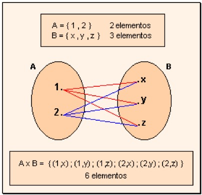
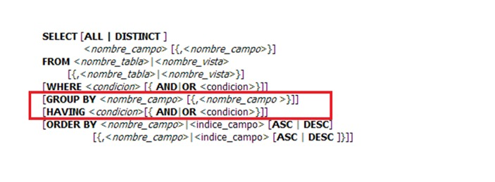
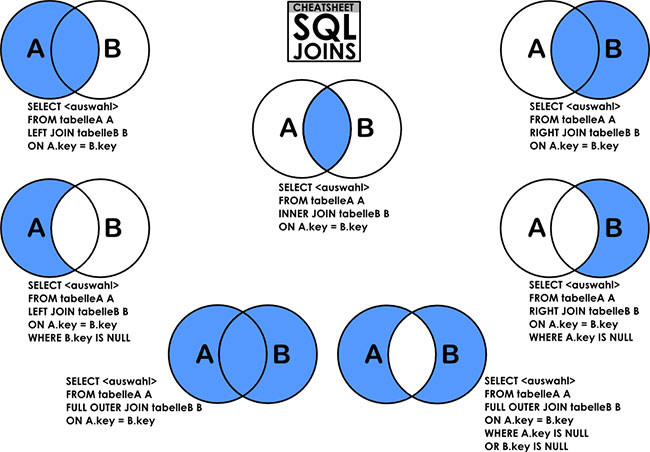

= DB/SQL-Tutorial

Una pequeña introduccion a conceptos sobre SQL y bases de datos con algunos ejemplos. Algunos conceptos o definiciones pueden ser especificas de MySQL pero se pueden extrapolar a otros motores de base de datos.

== ¿Que es una base de datos?

* Una base de datos o banco de datos es un conjunto de datos pertenecientes a un mismo contexto y almacenados sistemáticamente para su posterior uso. 

* Una biblioteca puede considerarse una base de datos compuesta en su mayoría por documentos y textos impresos en papel e indexados para su consulta. 

* Actualmente, y debido al desarrollo tecnológico de campos como la informática y la electrónica, la mayoría de las bases de datos están en formato digital (electrónico), y por ende se ha desarrollado y se ofrece un amplio rango de soluciones al problema del almacenamiento de datos.

== Distintos DBMS

* Algunas de los mas comunes son Oracle, MySQL, SQL Server, PostgreSQL, Firebird, MariaDB, SQL Lite.

image::images/DBMS.jpg[DBMS]

*SGBD (Sistema de gestión de bases de datos) = DBMS (Database Management System)*

== ¿Que es MySQL?

MySQL es un sistema de gestión de bases de datos relacional, multihilo y multiusuario.

== Unix Daemons/Windows Services

Un demonio o servicio es un tipo especial de proceso no interactivo, es decir, que se ejecuta en segundo plano en lugar de ser controlado directamente por el usuario. Este tipo de programas se ejecutan de forma continua (infinita).

== Arquitectura Cliente/Servidor

image::images/Architecture.jpg[Architecture]

* Servidor: Se encarga de recoger, interpretar y ejecutar todas las peticiones de los usuarios de la base de datos.

* Cliente: Es la parte con la que trabajarán directamente los usuarios.

== Conectividad Cliente/Servidor

* ODBC (Open Database Connectivity): Es un API standard para comunicarse con cualquier base de datos.
* ADO: Es el API standard de .NET para comunicarse con distintas bases de datos.
* JDBC (Java Database Connectivity): Es el API standard de Java para comunicarse con distintas bases de datos.

== DB Engine

El motor de base de dato sirven para definir, construir y manipular una base de datos.

* Definir una base de datos: Consisten en especificar los tipos de datos, estructuras y restricciones para los datos que se almacenaran.
* Construir una base de datos: Es el proceso de almacenar los datos sobre algun medio de almacenamiento. Ver: Storage Engine.
* Manipular una base de datos: Incluye funciones como consultas, actualizacion, etc. de bases de datos.

== Storage Engine

Algunas bases de datos nos permiten configurar el tipo de almacenamiento para sus tablas, dependiendo el caso podriamos querer usar alguno distinto. MySQL provee multiples tipos de almacenamientos, aunque los dos mas populares son InnoDB y MyISAM. InnoDB es el storage por defecto.

=== InnoDB

* Soporte de transacciones.
* Bloqueo de registros.
* Nos permite tener las características ACID (Atomicity, Consistency, Isolation and Durability), garantizando la integridad de nuestras tablas.
* Es probable que si nuestra aplicación hace un uso elevado de INSERT y UPDATE notemos un aumento de rendimiento con respecto a MyISAM.

=== MyISAM

* Mayor velocidad en general a la hora de recuperar datos.
* Recomendable para aplicaciones en las que dominan las sentencias SELECT ante los INSERT / UPDATE.
* Ausencia de características de atomicidad ya que no tiene que hacer comprobaciones de la integridad referencial, ni bloquear las tablas para realizar las operaciones, esto nos lleva como los anteriores puntos a una mayor velocidad.

== ACID

* Atomicidad (Atomicity): La Atomicidad requiere que cada transacción sea "todo o nada": si una parte de la transacción falla, todas las operaciones de la transacción fallan, y por lo tanto la base de datos no sufre cambios. Un sistema atómico tiene que garantizar la atomicidad en cualquier operación y situación, incluyendo fallas de alimentación eléctrica, errores y caidas del sistema.
* Consistencia (Consistency): La propiedad de Consistencia se asegura que cualquier transacción llevará a la base de datos de un estado válido a otro estado válido. Cualquier dato que se escriba en la base de datos tiene que ser válido de acuerdo a todas las reglas definidas, incluyendo (pero no limitado a) los constraints, los cascades, los triggers, y cualquier combinación de estos.
* Aislamiento (Isolation): El aislamiento ("Isolation" en inglés) se asegura que la ejecución concurrente de las transacciones resulte en un estado del sistema que se obtendría si estas transacciones fueran ejecutadas una atrás de otra. Cada transacción debe ejecutarse en aislamiento total; por ejemplo, si T1 y T2 se ejecutan concurrentemente, luego cada una debe mantenerse independiente de la otra.
* Durabilidad (Durability): La durabilidad significa que una vez que se confirmó una transacción (commit), quedará persistida, incluso ante eventos como pérdida de alimentación eléctrica, errores y caidas del sistema. Por ejemplo, en las bases de datos relacionales, una vez que se ejecuta un grupo de sentencias SQL, los resultados tienen que almacenarse inmediatamente (incluso si la base de datos se cae inmediatamente luego).

== SQL vs ANSI SQL

El SQL es un lenguaje de acceso a bases de datos que explota la flexibilidad y potencia de los sistemas relacionales y permite así gran variedad de operaciones.

image::images/ANSI.jpg[ANSI]

*Comentarios*: El unico tipo de comentario que es ANSI es el que empieza con '--'

== Commands vs SQL

* SQL (Structured Query Language): Es un lenguaje declarativo de acceso a bases de datos relacionales. i.e: SELECT * FROM people.

* Commands (Comandos): Son instrucciones que brinda el servidor de bases de datos para obtener determinada información. i.e: SHOW DATABASES, SHOW STATUS, SHOW VARIABLES, DESCRIBE <TABLE_NAME>.

== SQL Sentences

image::images/Sentences.jpg[SQL Sentences]

== Data Modeling

image::images/DataModeling.jpg[Data Modeling]

== MySQL Data Types

=== Numeric Types

|=======
|Tipo de Campo|Tamaño de Almacenamiento|Mínimo (Signed/Unsigned)|Máximo (Signed/Unsigned)
|TINYINT|1 byte|-128/0|127/255
|SMALLINT|2 bytes|-32768/0|32767/65535
|MEDIUMINT|3 bytes|-8388608/0|8388607/16777215
|INT, INTEGER|4 bytes|-2147483648/0|2147483647/4294967295
|BIGINT|8 bytes|-9223372036854775808/0|9223372036854775807/18446744073709551615
|FLOAT|4 bytes||
|FLOAT(x)|4 bytes if 0 \<= x \<= 24, 8 bytes if 25 \<= x \<= 53||
|DOUBLE|8 bytes||
|DECIMAL(M,D), NUMERIC (M, D)|||
|BIT(M)|Aproximadamente (M+7)/8 bytes||
|=======

=== Date Types

|=======
|Tipo de Campo|Tamaño de Almacenamiento|Zero Value
|DATE|3 bytes|'0000-00-00'
|DATETIME|8 bytes|'0000-00-00 00:00:00'
|TIMESTAMP|4 bytes|00000000000000
|TIME|3 bytes|'00:00:00'
|YEAR|1 byte|0000
|=======

* Date: Almacena fechas en formato YYYY-MM-DD
* Datetime: Almacena fechas en formato YYYY-MM-DD HH:MM:SS
* Timestamp: Almacena fechas en formato YYYY-MM-DD HH:MM:SS pero con conversión entre el Timezone actual y UTC.
* Time: Almacena  HH:MM:SS
* Year: Almacena el año en formato YYYY o YY.

Si las fechas son invalidad son convertidas a "zero" value.

=== String Types

|=======
|Tipo de columna|Almacenamiento requerido|Máxima Longitud
|CHAR(M)|M bytes, 0 \<= M \<= 255|255
|VARCHAR(M)|L+1 bytes, donde L \<= M y 0 \<= M \<= 255|255
|BINARY(M)|M bytes, 0 \<= M \<= 255|255
|VARBINARY(M)|L+1 bytes, donde L \<= M y 0 \<= M \<= 255|255
|TINYBLOB, TINYTEXT|L+1 byte, donde L < 2^8|255
|BLOB, TEXT|L+2 bytes, donde L < 2^16|65535
|MEDIUMBLOB, MEDIUMTEXT|L+3 bytes, donde L < 2^24|16,777,215
|LONGBLOB, LONGTEXT|L+4 bytes, donde L < 2^32|4,294,967,295
|=======

|=======
|Valor|CHAR(4)|Almacenamiento Necesario|VARCHAR(4)|Almacenamiento Necesario
|''|'----'|4 bytes|''|1 byte
|'ab'|'ab--'|4 bytes|'ab'|3 byte
|'abcd'|'abcd'|4 bytes|'abcd'|5 byte
|'abcdefgh'|'abcd'|4 bytes|'abcd'|5 byte
|=======

=== Additional Types

|=======
|Tipo de columna|Almacenamiento requerido|Máxima Longitud
|ENUM('value1','value2',...)|1 o 2 bytes, dependiendo del número de valores de la enumeración (65,535 valores máximo)|65,535 Miembros
|SET('value1','value2',...)|1, 2, 3, 4, o 8 bytes, dependiendo del número de miembros del conjunto (64 miembros máximo)|64 Miembros
|=======

==== Enum

* Sólo contiene un valor
* Se puede definir la lista de hasta 65535 valores distintos
* Si se permite NULL, este será el valor por defecto; sinó, y si no se define con DEFAULT, será el primer valor de la lista (en el ejemplo de arriba, si no defino el DEFAULT ‘medium’, por defecto sería ‘small’)
* Cada valor de la lista es numerado con un índice (empieza desde el 1), pudiendo usar el índice en vez del valor de la lista (en el ejemplo de arriba: 1=>’small’, 2=>’medium’ y 3=>’large’)
* En caso de introducir un valor no perteciente a la lista, el campo pasará a valer ”, una cadena vacía, que tiene el índice zero
* El índice de NULL es NULL,
* Para retornar el índice de un campo del tipo ENUM, podemos sumar zero al campo (SELECT size+0 FROM …)
* De almacenamiento físico, ocupará 1 byte si hay 255 o menos valores en la lista, o 2 bytes si hay 256 o más valores

==== Set

* Contiene zero, uno o varios valores
* Se puede definir la lista de hasta 64 valores distintos
* Los valores no pueden contener comas, ya que los valores asignados son separados por comas
* Cada valor de la lista representa un bit de la cadena de bits del campo
* El valor decimal del campo determina los bits, marcando los valores que contiene el campo,de manera que si todos los bits estan a 1, es que ese campo contiene todos los valores (ejemplo: si el valor decimal es 7, en binario sería 0111, y eso quiere decir que el campo contiene los valore 'a', 'b' y 'c')

|=======
|SET|Decimal|Bytes
|'a'|1|0001
|'b'|2|0010
|'c'|4|0100
|'d'|8|1000
|=======
* De almacenamiento físico, ocupará 1, 2, 3, 4, o 8 bytes, según la longitud de la lista de valores (si N es el número de valores, la formula es (N+7)/8 bytes)

== Column Attributes

* PK (Primary Key): Indica si la columna forma parte de la clave principal. Hay claves simples o compuestas (Mas de una columna). En general toda tabla tiene PK.
* NN (Not Null): Indica que esta columna no puede ser NULL. NULL no es vacio ni 0, seria como indefinido.
* UQ (Unique Index): Indica que esta columna no tendrá ningún valor repetido.
* BIN (Is Binary Column): Indica que esta columna se almacenara en modo “Binario”. Respeta mayúsculas y minúsculas usando el collation binario.
* UN (Unsigned Data Type): Indica que esta columna no usara un byte para el signo, ósea números positivos solamente.
* ZF (Zero Fill): El campo se completara con ceros si es numérico.
* AI (Auto Incremental): El campo incrementa solo su valor. Cada tabla solo acepta un auto incremental y si hay tiene que formar parte de la PK.
* G (Generated): Este tipo de campo es calculado en base a una expresión que puede utilizar el valor de otras columnas.

== Charset/Collation

* Charset: Hace referencia al conjunto de caracteres y como persistir los mismos.
* Collation: Es un juego de reglas para comparar y ordenar caracteres de un conjunto de caracteres.

[source,sql]
--
-- Muestra los CHARSETs instalados
SHOW CHARACTER SET;
-- Muestra COLLATIONS instalados
SHOW COLLATION;
--

[source,sql]
--
-- Parte 1
-- Creamos la tabla
DROP TABLE IF EXISTS collation_prueba;

CREATE TABLE IF NOT EXISTS collation_prueba (
    columna_1 CHAR(5) CHARSET utf8 COLLATE utf8_unicode_ci,
    columna_2 CHAR(5) CHARSET latin1 COLLATE latin1_general_cs,
    columna_3 CHAR(5) CHARSET ASCII COLLATE ascii_general_ci,
    columna_4 CHAR(5) CHARSET utf8 COLLATE utf8_bin,
    columna_5 CHAR(5) CHARSET latin1 COLLATE latin1_bin,
    columna_6 CHAR(5) CHARSET ASCII COLLATE ascii_bin
);

-- Parte 2
-- Insertamos los datos
INSERT INTO collation_prueba VALUES ('Ñandú','Ñandú','Nandu','Ñandú','Ñandú','Nandu');

-- Parte 3
-- Analizamos el tamaño en bytes y cantidad de caracteres en los distintos charsets (Ver Nota 1 y 2)
SELECT LENGTH(columna_1) AS 'BinaryLength01', CHAR_LENGTH(columna_1) AS 'CharLength01' FROM collation_prueba
UNION ALL
SELECT LENGTH(columna_2) AS 'BinaryLength02', CHAR_LENGTH(columna_2) AS 'CharLength02' FROM collation_prueba
UNION ALL
SELECT LENGTH(columna_3) AS 'BinaryLength03', CHAR_LENGTH(columna_3) AS 'CharLength03' FROM collation_prueba;

-- Parte 4
-- Analizamos como el collation afecta las comparaciones binarias (Ver Nota 3)
SELECT * FROM collation_prueba WHERE columna_1 LIKE 'N%';
SELECT * FROM collation_prueba WHERE columna_1 LIKE 'ñ%';
SELECT * FROM collation_prueba WHERE columna_1 LIKE 'Ñ%';
SELECT * FROM collation_prueba WHERE columna_4 LIKE 'N%';
SELECT * FROM collation_prueba WHERE columna_4 LIKE 'ñ%';
SELECT * FROM collation_prueba WHERE columna_4 LIKE 'Ñ%';

-- Parte 5
-- Analizamos como el collation afecta el ordenamiento (Ver Nota 4)
CREATE TABLE IF NOT EXISTS spanish_collation (
	columna_1 VARCHAR(15) CHARSET utf8 COLLATE utf8_spanish_ci,
    columna_2 VARCHAR(15) CHARSET utf8 COLLATE utf8_spanish2_ci
);

INSERT INTO spanish_collation VALUES
('Baño', 'Baño'),('Carlos', 'Carlos'),
('Cruzada', 'Cruzada'),('Chile', 'Chile'),
('Llorar', 'Llorar'),('Lámina', 'Lámina'),
('Loreto', 'Loreto'),('Dedo', 'Dedo');

SELECT * FROM spanish_collation ORDER BY columna_1;
SELECT * FROM spanish_collation ORDER BY columna_2;
--

*1)* Lo primero que debemos notar es que el Charset ASCII no permite ingresar otra cosa que no esté en la tabla ASCII predeterminada, así que la letra "Ñ" y aquellas letras con tilde quedan absolutamente descartadas.

*2)* Como vemos, en UTF-8 se guardaron 7 bytes de información (un byte extra en la letra "Ñ", otro byte extra en la letra "ú") pero el largo de cada cadena en cada caso es de 5 caracteres.

*3)* Las primeras 3 (CHARSET utf8 COLLATE utf8_general_ci) devolverán un registro cada uno, mientras que de las últimas 3 (CHARSET utf8 COLLATE utf8_bin) sólo el último devolverá un resultado positivo.Esto se debe a que la columna "name01" tiene COLLATION utf8-general-ci, que, entre otras cosas, considera como sinónimo la letra "N" y "Ñ", y además es case-insensitive (utf8-general-ci). Esto también se aplica a los tildes, de forma que si buscamos por ñandu (sin tilde) el resultado entregado será el mismo que si buscamos por "Ñandú"De igual forma, "ÑaÑdU" igual entregará un resultado positivo para "Ñandú". En las últimas 3 sin embargo, si no buscamos exactamente por lo ingresado en la base de datos no se devolverá ningún registro, así que cualquier cosa que no sea un match exacto de "Ñandú" simplemente se descartará.

*4)* Una COLLATION utf8_spanish_ci ordenará los registros de una forma mientras que utf8_spanish2_ci la ordenará de otra, debido a que el español tradicional considera "ch" como una letra entre la "C" y la "D". Asimismo, considera el uso de la letra "LL" como una letra entre la "L" y "M".

== Indexes

Cuando creamos un índices lo hacemos con el objectivo de acelerar futuras busquedas sobre los datos que poseemos. Cada motor de base de datos ofrece distintos tipos de índices pero varias son comunes y algunos son mas especificos para cada DB.
MySQL hay cinco tipos de índices:

* PRIMARY KEY: Este índice se ha creado para generar consultas especialmente rápidas, debe ser único y no se admite el almacenamiento de NULL.
* INDEX (Non-Unique): Son usados indistintamente por MySQL, permite crear índices sobre una columna, sobre varias columnas o sobre partes de una columna.
* UNIQUE: Este tipo de índice no permite el almacenamiento de valores iguales.
* FULLTEXT: Permiten realizar búsquedas de palabras. Sólo pueden usarse sobre columnas CHAR, VARCHAR o TEXT.
* SPATIAL: Este tipo de índices solo puede usarse sobre columnas de datos geométricos (spatial) y en el motor MyISAM.

== Temporary Tables

En algunas DB podemos crear tablas temporales, la ventaja de estas tablas es que son solo visibles dentro de la conexión en cuales fueron creadas y al cerrar la conexión serán eliminadas, de esta manera dos personas con distintas conexiones podrían usar el mismo nombre para una tabla del tipo temporal. Además estas tablas son borradas automáticamente al cerrar la conexión.
En general se usan para cálculos auxiliares ya sea consolidar datos o aplicar criterios de búsqueda o agrupación.

== TRUNCATE vs DELETE

La sentencia TRUNCATE TABLE nos permite dejar vacía una tabla de forma simple y sencilla.

|=======
|TRUNCATE|DELETE
|DDL|DML
|Desasigna las paginas de memoria|Remueve fila por fila
|Rapido|Lento
|No invoca los triggers de DELETE|Invoca triggers de DELETE
|Resetea AUTO_INCREMENT|No Resetea AUTO_INCREMENT
|Menor Locking|Mayor Locking
|Remueve todas las paginas|Puede dejar paginas en blanco
|=======

== Producto Cartesiano

Este es uno de los problemas mas típicos y peligrosos que podemos tener con nuestras sentencias SELECTs.

[source,sql]
--
-- Esta consulta nos devuelve todos los registros de la tabla turnos
SELECT 
    *
FROM
    turnos;

-- La siguiente consulta genera un PRODUCTO CARTESIANO ya que nos estamos estableciendo ninguna condicion de union entre ellas, por los tanto cada fila de une con todas las demas
SELECT
    *
FROM
    turnos t1,
    turnos t2;
--

== Escape characters

En algunas situaciones debemos escapear los caracteres para que no se interpreten de forma especial, dependiendo si usamos el operador = o LIKE, la forma puede variar. Esto se debe a que el LIKE remueve una \ al hacer el parseo y otro al hacer la comparación.

|=======
|Operador =|Operador LIKE|Caracter representado
|\'|\\'|Comillas simples
|\"|\\"|Comillas dobles
|\b|\\b|Backspace
|\n|\\n|New Line(Line feed)
|\r|\\r|Carriage return
|\t|\\t|Tab
|\Z|\\Z|ASCII 26 (Control+Z)
|\\|\\\\|Backslash
|\%|\\%%|Porcentaje
|\_|\\_|Guion bajo
|=======

== DDL Sentences

Vamos a ver algunas sentencias del tipo DDL (Data Definition Language).

=== Creacion

[source,sql]
--
-- Crea el schema donde vamos a trabajar.
CREATE SCHEMA tutorial;

-- Podemos ejecutar la misma sentencia pero solo se ejecutara si la DB no existe.
CREATE DATABASE IF NOT EXISTS tutorial;

-- Creamos una tabla 
CREATE TABLE tutorial.alumnos (
    id_alumno INT UNSIGNED NOT NULL AUTO_INCREMENT,
    nombre VARCHAR(100) NOT NULL,
    apellido VARCHAR(100) NOT NULL,
    dni VARCHAR(20) NOT NULL,
    fecha_nacimiento DATE NOT NULL,
    materias_cursadas TINYINT UNSIGNED NULL DEFAULT 0,
    promedio FLOAT NULL,
    activo BIT(1) NOT NULL DEFAULT 1,
    PRIMARY KEY (id_alumno)
);

-- Creamos un Unique Index sobre la columna dni
CREATE UNIQUE INDEX idx_dni_unique ON tutorial.alumnos(dni ASC);

-- Podemos crear una View (Es una forma simple de poner un "alias" a una consulta compleja)
CREATE VIEW tutorial.alumnos_aprobados AS
    SELECT * FROM tutorial.alumnos WHERE promedio >= 7;

-- Podemos crear un Stored Procedure (Seria algo similar a un script de sentencias SQL)
DELIMITER $$
CREATE PROCEDURE tutorial.eliminar_alumnos_desactivados ()
BEGIN
    DELETE FROM tutorial.alumnos WHERE activo = 0;
END $$
--

*Nota*: Otra forma posible de crear una tabla es desde el resultado de una sentencia SELECT.
[source,sql]
--
CREATE TABLE alumnos_backup
SELECT
    *
FROM
    alummnos;
--

=== Borrado

[source,sql]
--
DROP INDEX idx_dni_unique ON tutorial.alumnos;

DROP TABLE tutorial.alumnos;

DROP VIEW tutorial.alumnos_aprobados;

DROP PROCEDURE tutorial.eliminar_alumnos_desactivados;

DROP DATABASE IF EXISTS tutorial;

DROP SCHEMA tutorial;
--

=== Modificacion

[source,sql]
--
ALTER TABLE tutorial.alumnos
    ADD COLUMN primera_columna VARCHAR(50) NULL DEFAULT 'Primera' FIRST;

ALTER TABLE tutorial.alumnos
    ADD COLUMN ultima_columna VARCHAR(50) NULL DEFAULT 'Ultima';

ALTER TABLE tutorial.alumnos 
    ADD COLUMN siguiente_columna VARCHAR(50) NULL DEFAULT 'Siguiente' AFTER fecha_nacimiento;

ALTER TABLE tutorial.alumnos 
    ADD INDEX idx_nombre (nombre ASC);

ALTER TABLE tutorial.alumnos 
    DROP COLUMN primera_columna;

ALTER TABLE tutorial.alumnos 
    DROP COLUMN siguiente_columna, 
    DROP COLUMN ultima_columna;

ALTER TABLE tutorial.alumnos
    ADD COLUMN direccion VARHCAR(100) NULL,
    ADD COLUMN codigo_alumno INT NULL,
    ADD INDEX idx_codigo_alumno (codigo_alumno ASC);

RENAM TABLE alumnos TO rename_alumnos;
--

== DML

Para empezar a probar las distintas sentencias DML podemos utilizar el archivo link:backup/DB.sql["DB.sql"] para crear e inicializar nuestra DB.

=== SELECT

La clausula SELECT sirve para seleccionar datos.
[source,sql]
--
-- Muestra todos los registros de la tabla alumnos y todas sus columnas
SELECT * FROM alumnos;
-- Muestra todos los registros de la tabla alumnos pero solo dos columnas
SELECT id_alumno, nombre FROM alumnos;
-- Suma dos numeros y devuelve su resultado en una columna llamada "Suma"
SELECT 2 + 2 AS Suma;
-- Muestra la frase "Hola Mundo" en una columna llamada "Texto"
SELECT 'Hola Mundo' AS Texto;
-- Utiliza una funcion que recibe varias cadenas de caracteres y las concatenas
SELECT CONCAT('Hola', 'Mundo') AS Resultado;
--

=== SELECT + WHERE

La clausula WHERE sirve para agregar condiciones de filtrado para los datos.
[source,sql]
--
-- Seleccionamos todos los alumnos donde sus promedio es 7
SELECT * FROM alumnos WHERE promedio = 7;
-- Seleccionamos todos los alumnos donde sus promedio es NULL (Indefinido)
SELECT * FROM alumnos WHERE promedio \<\=> NULL;
-- Seleccionamos todos los alumnos donde sus promedio es NULL (Indefinido)
SELECT * FROM alumnos WHERE promedio IS NULL;

-- Selecionamos todos los alumnos donde su promedio es mayor o igual a 4 y la cantidad de materias cursadas mayor a 3
SELECT * FROM alumnos WHERE promedio >= 4 AND materias_cursadas > 3;

-- Selecionamos todos los alumnos dodne sus promedio es 6 o 8.5
SELECT * FROM alumnos WHERE promedio = 6 OR promedio = 8.5;
--

=== Operadores de comparación

|=======
|Operador|Descripción
|\<=|Menor o igual
|<|Menor
|>|Mayor
|>=|Mayor o igual
|!=, <>|Distinto
|\<\=>|Comparación Segura
|=======

*Nota*: El operador "=" devuelve siempre NULL si alguna de las dos partes es NULL en cambio el operador "\<\=>" compara el valor contra NULL y devuelve su valor de verdad. Si ambos son NULL retorna 1, y en el caso de un NULL retorna 0.

[source,sql]
--
-- Devuelve 0 filas
SELECT * FROM institutos WHERE cantidad_personal > 50 AND barrio = NULL;

-- Devuelve 1 fila
SELECT * FROM institutos WHERE cantidad_personal > 50 AND barrio \<\=> NULL;

-- Devuelve 4 filas
SELECT * FROM institutos WHERE cantidad_personal > 100 AND barrio = NULL;

-- Devuelve 5 fila
SELECT * FROM institutos WHERE cantidad_personal > 100 AND barrio \<\=> NULL;
--

=== Operadores lógicos (AND/OR)

|=======
|Expr1|Expr2|Expr1 AND Expr2
|FALSO|FALSO|*FALSO*
|FALSO|VERDADERO|*FALSO*
|VERDADERO|FALSO|*FALSO*
|VERDADERO|VERDADERO|*VERDADERO*
|FALSO|NULL|*FALSO*
|NULL|FALSO|*FALSO*
|VERDADERO|NULL|*NULL*
|NULL|VERDADERO|*NULL*
|=======

|=======
|Expr1|Expr2|Expr1 OR Expr2
|FALSO|FALSO|*FALSO*
|FALSO|VERDADERO|*VERDADERO*
|VERDADERO|FALSO|*VERDADERO*
|VERDADERO|VERDADERO|*VERDADERO*
|FALSO|NULL|*NULL*
|NULL|FALSO|*NULL*
|VERDADERO|NULL|*VERDADERO*
|NULL|VERDADERO|*VERDADERO*
|=======

=== Operadores lógicos (XOR)

|=======
|Expr1|Expr2|Expr1 OR Expr2
|FALSO|FALSO|*FALSO*
|FALSO|VERDADERO|*VERDADERO*
|VERDADERO|FALSO|*VERDADERO*
|VERDADERO|VERDADERO|*FALSO*
|FALSO|NULL|*NULL*
|NULL|FALSO|*NULL*
|VERDADERO|NULL|*NULL*
|NULL|VERDADERO|*NULL*
|=======

=== BETWEEN

Se utiliza para aplicar un filtro por rangos. Esta se puede aplicar con números, fechas. Se puede usar con el NOT.

[source,sql]
--
-- Recuperamos todos los alumnos que tienen entre 1 y 5 materias cursadas
SELECT * FROM alumnos WHERE materias_cursadas BETWEEN AND 5;

-- Recuperamos todos los alumnos que NO tienen entre 1 y 5 materias cursadas, pueden ser mas o menos
SELECT * FROM alumnos WHERE materias_cursadas NOT BETWEEN AND 5;

-- Recuperamos todos los alumnos que su fecha de nacimiento esta dentro de un rango especifico
SELECT * FROM alumnos WHERE fecha_nacimiento BETWEEN '1980-01-01' AND '1986-01-07';

-- Recuperamos todos los alumnos que su fecha de nacimiento NO esta dentro de un rango especifico
SELECT * FROM alumnos WHERE fecha_nacimiento NOT BETWEEN '1980-01-01' AND '1986-01-07';

-- Recuperamos todos los alumnos que el campo auditoria esta dentro de un rango especifico (Es importante notar que el campo es del tipo TIMESTAMP por eso necesitamos incluir hora:minutos:segundos para el filtrado)
SELECT * FROM alumnos WHERE auditoria BETWEEN '2013-01-01 00:00:00' AND '2013-03-17 23:59:59';

-- Recuperamos todos los alumnos que el campo auditoria No esta dentro de un rango especifico
SELECT * FROM alumnos WHERE auditoria NOT BETWEEN '2013-01-01 00:00:00' AND '2013-03-17 23:59:59';
--

=== IN

Se utiliza para aplicar un filtro por un conjunto de valores, cada valor debe estar separado por coma. Se puede usar con el NOT.

[source,sql]
--
-- Seleccionamos todos los alumnos donde las materias cursadas es (1 OR 5 OR 6)
SELECT * FROM alumnos WHERE materias_cursadas IN (1, 5, 6);

-- Seleccionamos todos los alumnos donde las materias cursadas NO es (1 OR 5 OR 6)
SELECT * FROM alumnos WHERE materias_cursadas NOT IN (1, 5, 6);

-- Seleccionamos todos los alumnos donde la fecha de nacimiento es alguna de las dos del grupo
SELECT * FROM alumnos WHERE fecha_nacimiento IN ('1986-01-07', '1984-03-04');

-- Seleccionamos todos los alumnos donde la fecha de nacimiento NO es alguna de las dos del grupo
SELECT * FROM alumnos WHERE fecha_nacimiento NOT IN ('1986-01-07', '1984-03-04');

-- Seleccionamos todos los alumnos donde el nombre es igual a alguno del grupo
SELECT * FROM alumnos WHERE nombre IN ('Patricia', 'Lorena');

-- Seleccionamos todos los alumnos donde el nombre NO es igual a alguno del grupo
SELECT * FROM alumnos WHERE nombre NOT IN ('Patricia', 'Lorena');
--

=== LIKE

Se utiliza para aplicar un filtro usando un patrón, ósea podemos filtrar los datos los cuales la columna seleccionada cumple con el patrón ingresado. También podemos utilizar NOT LIKE. Funciona sobre cualquier tipo de columna números, texto, fechas.

[source,sql]
--
-- Seleccionamos todos los alumnos cuyo nombre contenga "na" en cualquier parte
SELECT * FROM alumnos WHERE nombre LIKE '%na%';

-- Seleccionamos todos los alumnos cuyo nombre contenga "na" al final
SELECT * FROM alumnos WHERE nombre LIKE '%na';

-- Seleccionamos todos los alumnos cuyo nombre contenga "na" al principio
SELECT * FROM alumnos WHERE nombre LIKE 'na%';

-- Seleccionamos todos los alumnos cuyo nombre contenta "na" al principio luego dos caracteres cualquieras y despues "lia"
SELECT * FROM alumnos WHERE nombre LIKE 'na__lia';

-- Escapear caracteres

-- Seleccionamos todos los alumnos donde su nombre sea 'Luis%' o sea que contengan el caracter % al final
SELECT * FROM alumnos WHERE nombre LIKE 'Luis\%';

-- Seleccionamos todos los alumnos donde su nombre se 'Luis_' o sea que contengan el caracter _ al final
SELECT * FROM alumnos WHERE nombre LIKE 'Luis\_';

-- Seleccionamos todos los alumnos donde su nombre contenga una barra
SELECT * FROM alumnos WHERE nombre LIKE 'Luis\\\\%';
--

=== ORDER BY

Se utiliza para definir un criterio para el orden y definir en que forma queremos ordenar los datos, se puede usar una columna sola o N columnas.

[source,sql]
--
-- Seleccionamos todos los alumnos pero solo las columnas nombre y apellido. El resultado estara ordenado por nombre en forma ascendente y apellido en forma ascendente
SELECT * FROM nombre, apellido FROM alumnos ORDER BY nombre, apellido;

-- Seleccionamos todos los alumnos pero solo las columnas nombre y apellido. El resultado estara ordenado por nombre en forma ascendente y apellido en forma descendente
SELECT * FROM nombre, apellido FROM alumnos ORDER BY nombre, apellido DESC;

-- Seleccionamos todos los alumnos pero solo las columnas nombre y apellido. El resultado estara ordenado por nombre en forma descendente y apellido en forma ascendente
SELECT * FROM nombre, apellido FROM alumnos ORDER BY nombre DESC, apellido;

-- Seleccionamos todos los alumnos pero solo las columnas nombre y apellido. El resultado estara ordenado por nombre en forma descendente y apellido en forma descendente
SELECT * FROM nombre, apellido FROM alumnos ORDER BY nombre DESC, apellido DESC;
--

=== LIMIT

La clausula LIMIT es útil para pedir un cierto numero de registros. En otros motores de base de datos se llama TOP.

[source,sql]
--
-- Esta consulta devuelve todos los registros que contiene la tabla
SELECT * FROM alumnos;

-- Esta consulta devuelve todos los registros donde materias_cursadas es mayor a 8, lo cual podrian ser todos, algunos o ningun registro, no tengo control sobre el maximo numero de registros que puede retornar
SELECT * FROM alumnos WHERE materias_cursadas > 8;

-- Esta consulta pone un maximo de 10 para la cantidad de registros devueltos
SELECT * FROM alumnos WHERE materias_cursadas > 8 LIMIT 10;

-- Aqui estamos poniendo un maximo de 2 registros pero empezando desde el 5
SELECT * FROM alumnos WHERE materias_cursadas > 8 LIMIT 5, 2;

-- Esta consulta retorna lo mismo que simplemente LIMIT 10, ya que si no definimos el offset este se considera 0
SELECT * FROM alumnos WHERE materias_cursadas > 8 LIMIT 0, 10;
--

=== IFNULL & CASE

La función IFNULL y la estructura CASE son muy usadas en muchas consultas. Estas varian de nombre dependiendo el motor de base de datos.

* IFNULL: Recibe dos parámetros y si el primero es NULL devuelve el segundo.
* CASE: Es una estructura de control.

[source,sql]
--
SELECT
    id_instituto,
    barrio,
    IFNULL(barrio, 'No tiene barrio asignado') AS 'Comentario',
    CASE
        WHEN barrio = 'Puerto Madero' THEN 'Barrio centrico'
        WHEN barrio = 'Recoleta' THEN 'Barrio centrico'
        ELSE THEN 'Barrio no centrico'
    END AS 'Descripcion'
FROM
    institutos;
--

=== COLLATE

Es especifica de MySQL y se utiliza para definir cual es el collation que queremos usar para esa comparación o ordenamiento en ese momento.

[source,sql]
--
-- Ordenamos por la columna apellido, si hay mayusculas y minisculas quedan en el orden que fueron ingresados a la tabla
SELECT apellido FROM alumnos ORDER BY apellido;

-- Ordenamos por la columna apellido, si hay mayusculas y minisculas se ordenaran primero las mayusculas ya que la comparacion es binaria
SELECT apellido FROM alumnos ORDER BY apellido COLLATE latin1_bin;

-- Selecciona todos los alumnos que se llamen 'lorena' OR 'Lorena', no diferencia entre mayusculas y minusculas
SELECT * FROM alumnos WHERE nombre = 'lorena';

-- Selecciona todos los alumnos que se llamen 'Lorena'
SELECT * FROM alumnos WHERE nombre COLLATE latin1_bin = 'Lorena';

-- Selecciona todos los alumnos que se llamen 'lorena'
SELECT * FROM alumnos WHERE nombre COLLATE latin1_bin = 'lorena';
--

Cuando hablamos de COLLATE tambien es importante hablar del atributo BINARY el cual puede ser definido a nivel de columna.

[source,sql]
--
-- Si el collation es "latin 1 - default collation" no hay diferencia en las siguientes dos consultas
SELECT * FROM alumnos WHERE nombre = 'Lorena';
SELECT * FROM alumnos WHERE nombre = 'lorena';

-- Si modificamos la columna para que esa columna sea BINARY
ALTER TABLE alumnos CHANGE COLUMN nombre nombre VARCHAR(100) BINARY NOT NULL;

-- Ahora si veremos diferencia ya que el collation usado sera latin1_bin
--

Ademas es importante notar la diferencia entre el atributo BINARY a nivel de columna y que una columna sea
del tipo VARBINARY.

* BINARY: Es un atributo que indica que los datos se almacenan con el conjunto de caracteres correspondientes al collation, pero se utiliza el collation binario.
* VARBINARY: Es un tipo de dato para indicar que los datos se almacenan en formato binario.

=== INSERT

Sirve para insertar registro en una tabla.

[source,sql]
--
-- Insertamos un nuevo registro en la tabla alumnos. No mencionamos la columna id_alumno ni auditoria ya que la primera es auto incremental y la otra tiene un default value
INSERT INTO tutorial.alumnos (
    'nombre',
    'apellido',
    'dni',
    'fecha_nacimiento',
    'materias_cursadas',
    'promedio',
    'activo')
VALUES (
    'Cosme',
    'Fulanito',
    '12345678',
    '1985-06-05',
    19,
    9.3,
    1
);
--

Tambien podemos utilizar una forma de INSERT mas simplificada donde no mencionamos las columnas ya que proveemos valores para todas.

[source,sql]
--
INSERT INTO tutorial.turnos VALUES (
    4,
    'Trasnoche',
    1);
--

Un problema que puede surgir es el famoso "Duplicate Key", si intentamos realizar dos INSERT con la misma primary key.

[source,sql]
--
INSERT INTO tutorial.turnos VALUES (
    5,
    'NuevoTurno',
    1);

INSERT INTO tutorial.turnos VALUES (
    5,
    'NuevoTurno',
    1);
--

MySQL ofrece una opcion para hacer IGNORE en caso de "Duplicate Key" y hacer un UPDATE en respuesta.

[source,sql]
--
-- Aca vemos todos los datos de la tabla turnos
SELECT * FROM turnos;

-- Insertamos un nuevo turno y lo dejamos desactivado
INSERT INTO turnos VALUES (4, 'Trasnoche', 0);

-- Ahora probamos insertar el mismo ID que antes, pero si usamos IGNORE no marca error
INSERT IGNORE INTO turnos VALUES (4, 'Trasnoche', 0);

-- Luego ademas de usar el IGNORE haremos un UPDATE frente al DUPLICATE KEY
INSERT IGNORE INTO turnos VALUES (4, 'Trasnoche', 0) ON DUPLICATE KEY UPDATE activo = 1;

-- Podemos utilizar VALUES para obtener valores del INSERT
INSERT IGNORE INTO turnos VALUES (4, 'Trasnoche', 1) ON DUPLICATE KEY UPDATE activo = VALUES(activo);
--

En algunas situaciones puede ser que querramos hacer un INSERT en base a un SELECT.

[source,sql]
--
DROP TABLE IF EXISTS turnos_backup;

CREATE TABLE turnos_backup
    SELECT * FROM turnos;

TRUNCATE TABLE turnos_backup;

INSERT INTO turnos_backup
    SELECT * FROM turnos;
--

=== DELETE

Sirve para borrar uno o mas registro de una tabla.

[source,sql]
--
-- DELETE nos permite borrar uno o mas registros en una tabla
DELETE FROM
    cursos
WHERE
    codigo_curso = 8;
--

En algunas situaciones queremos hacer un DELETE masivo

[source,sql]
--
-- Si ejecutamos el DELETE sin ninguna clausula WHERE, generamos un DELETE masivo
DELETE FROM cursos;
--

Si ejecutamos esto en MySQL puede ser que falle, dado que MySQL por defecto evita que 
hagamos DELETE masivos y para permitirlos debemos habilitarlos.

[source,sql]
--
SET SQL_SAFE_UPDATES = 0;
--

=== UPDATE

Sirve para actualizar uno o mas registro de una tabla.

[source,sql]
--
UPDATE
    alumnos
SET
    dni = '30421243'
WHERE
    id_alumno = 4;
--

Tanto con el UPDATE asi como con el DELETE podemos caer en el problema de olvidarnos de poner la clausula WHERE y generar un UPDATE masivo.

=== Subqueries

[source,sql]
--
-- Esta consulta retorna todos los registros de la tabla cursos_ofrecidos
SELECT
    *
FROM
    cursos_ofrecidos;

-- Esta consulta retorna todos los registros con id_turno = 2
SELECT
    *
FROM
    cursos_ofrecidos
WHERE
    id_turno = 2;

-- En algunas ocasiones no sabemos el id de lo que buscamos pero podemos obtenerlo por medio de otra consulta, entonces podemos usar una subconsulta para lograr esto
SELECT
    *
FROM
    cursos_ofrecidos
WHERE
    id_turno = (SELECT id_turno FROM turnos WHERE descripcion = 'Tarde');
--

Las subconsultas pueden ser usadas de varias formas, incluso podes hacer un FROM del resultado de una subconsulta.

[source,sql]
--
-- Aqui actualizamos la cantidad de materias cursadas de un alumno especifico
UPDATE
    alumnos
SET
    dni = '29346324'
WHERE
    id_alumno = 3;

-- Aqui actualiazamos la cantidad de materias cursadas para todos los alumnos que se tengan nombre igual a Nicolas y apellido igual a Franco
UPDATE
    alumnos
SET
    materias_cursadas = 0
WHERE
    id_alumno = (
        SELECT
            id_alumno
        FROM (
            SELECT
                id_alumno
            FROM
                alumnos
            WHERE
                nombre = 'Nicolas' AND
                apellido = 'Franco'
        ) AS tabla_consulta
    );
--

== Aggregate Functions

En SQL existen ciertas funciones que nos permiten trabajar con grupos de datos.

* COUNT: Nos permite contar registros.
* MAX: Nos permite obtener el máximo del grupo.
* MIN: Nos permite obtener el mínimo del grupo.
* SUM: Nos permite sumar ciertas columnas de un grupo de registros.
* AVG: Nos brinda el promedio.

=== COUNT

Esta función nos permite saber cuantos registros devuelve nuestra consulta.

[source,sql]
--
-- Retorna todos los registros de la tabla institutos
SELECT * FROM institutos;

-- Retorna el numero de registros de la tabla institutos
SELECT COUNT(*) FROM institutos;

-- Retorna todos los registros de la tabla institutos que tiene como barrio a Balvanera
SELECT * FROM institutos WHERE barrio = 'Balvanera';

-- Retorna el numero de registros de la tabla institutos que tiene como barrio a Balvanera
SELECT COUNT(*) FROM institutos WHERE barrio = 'Balvanera';
--

Podremos ver algunas variantes del COUNT como COUNT(*), COUNT(0), COUNT(1) no hay ninguna diferencia entre ellas, la unica diferencia sucede cuando en su lugar mencionamos una columna. i.e: COUNT(barrio) donde en este caso contaria todos los barrios distintos de NULL.

[source,sql]
--
SELECT COUNT(*) AS Resultado FROM institutos;
SELECT COUNT(0) AS Resultado FROM institutos;
SELECT COUNT(1) AS Resultado FROM institutos;

SELECT COUNT(barrio) AS Resultado FROM institutos;
--

=== MAX

Esta función devuelve el máximo valor de la columna que le indiquemos. Puede trabajar con columnas del tipo Numérico – Fechas – Cadena caracteres.

[source,sql]
--
-- Retorna el maximo valor para la columna cantidad_personal, o sea sobre una columna de tipo numerico.
SELECT MAX(cantidad_personal) AS Resultado FROM institutos;

-- Retorna el maximo valor para la columna fecha_apertura, o sea sobre una columna de tipo fecha.
SELECT MAX(fecha_apertura) AS Resultado FROM institutos;

-- Retorna el maximo valor para la columna fecha_apertura, o sea sobre una columna de tipo cadena de caracteres, por lo cual usa orden alfabetico.
SELECT MAX(barrio) AS Resultado FROM institutos;

-- En este caso muestra el maximo valor para cada tipo de columna.
SELECT 
    MAX(cantidad_personal) AS Resultado1,
    MAX(fecha_apertura) AS Resultado2,
    MAX(barrio) AS Resultado3
FROM institutos;
--

=== MIN

Esta función devuelve el mínimo valor de la columna que le indiquemos. Puede trabajar con columnas del tipo Numérico – Fechas – Cadena caracteres.

[source,sql]
--
-- Retorna el minimo valor para la columna cantidad_personal, o sea sobre una columna de tipo numerico.
SELECT MAX(cantidad_personal) AS Resultado FROM institutos;

-- Retorna el minimo valor para la columna fecha_apertura, o sea sobre una columna de tipo fecha.
SELECT MAX(fecha_apertura) AS Resultado FROM institutos;

-- Retorna el minimo valor para la columna fecha_apertura, o sea sobre una columna de tipo cadena de caracteres, por lo cual usa orden alfabetico.
SELECT MAX(barrio) AS Resultado FROM institutos;

-- En este caso muestra el maximo valor para cada tipo de columna.
SELECT 
    MIN(cantidad_personal) AS Resultado1,
    MIN(fecha_apertura) AS Resultado2,
    MIN(barrio) AS Resultado3
FROM institutos;
--

=== SUM

Esta función nos devuelve la suma de los valores de una determinada columna en base a los resultados entregados por la consulta principal.

[source,sql]
--
-- Suma la columna cantidad_personal de todos los registros
SELECT SUM(cantidad_personal) FROM institutos;

-- Suma la columna cantidad_personal de aquellos registros donde el barrio sea Balvanera
SELECT SUM(cantidad_personal) FROM institutos WHERE barrio = 'Balvanera';
--

=== AVG

Esta función nos devuelve el promedio que se calcula en base a la columna que le proporcionamos.

[source,sql]
--
-- Calcula el promedio de la columna cantidad_personal de todos los registros
SELECT AVG(cantidad_personal) FROM institutos;

-- Calcula el promedio de la columna cantidad_personal de aquellos registros donde el barrio sea Balvanera
SELECT AVG(cantidad_personal) FROM institutos WHERE barrio = 'Balvanera';
--

*Nota*: AVG = SUM(columna) / COUNT (*)

== GROUP BY & HAVING

Esta clausula sirve para indicar el criterio de agrupación. En general lo usamos con funciones de agrupación o de agregación (COUNT, MAX, MIN, SUM, AVG).

La idea de de agrupación nos permite unir varias filas en una sola.

[source,sql]
--
SELECT barrio FROM institutos;

SELECT barrio FROM institutos GROUP BY barrio;
--

Dado que la clausula GROUP BY genera grupos de datos, en la clausula del SELECT vamos a mencionar columnas que acabamos de agrupar o funciones de agregacion

[source,sql]
--
SELECT
    barrio,
    SUM(cantidad_personal) AS Cantidad_De_Personal_Por_Barrio,
    AVG(cantidad_personal) AS Promedio_Personal_Por_Barrio,
    COUNT(*) AS Cantidad_De_Filas_Agrupadas,
    MAX(cantidad_personal) AS Maxima_Cantidad_De_Personal_En_Un_Instituto_Agrupo_Por_Barrio
FROM
    institutos
GROUP BY
    barrio;
--

Ademas puede ser que necesitemos aplicar algun filtro a estos datos agrupados, aqui es donde aparece la clausula HAVING, la cual funciona como la zona de filtrado para los datos agrupados.

[source,sql]
--
SELECT
    barrio,
    SUM(cantidad_personal) AS Cantidad_De_Personal_Por_Barrio,
    AVG(cantidad_personal) AS Promedio_Personal_Por_Barrio,
    COUNT(*) AS Cantidad_De_Filas_Agrupadas,
    MAX(cantidad_personal) AS Maxima_Cantidad_De_Personal_En_Un_Instituto_Agrupo_Por_Barrio
FROM
    institutos
GROUP BY
    barrio
HAVING
    SUM(cantidad_personal) > 200;
--

*Nota*: Veamos que la diferencia entre el WHERE y el HAVING es el momento cuando se aplican

[source,sql]
--
-- Esta consulta primero recorre todas las filas y se queda con aquellas que cumplen la condicion "cantidad_personal > 100" y luego agrupa por barrio
SELECT
    barrio
FROM
    institutos
WHERE
    cantidad_personal > 100
GROUP BY
    barrio;

-- Esta consulta primero agrupa las filas y realiza la suma de cantidad de personal en cada barrio, para luego quedarse con aquellas filas donde la suma dio > 100
SELECT
    barrio
FROM
    institutos
GROUP BY
    barrio
HAVING
    SUM(cantidad_personal) > 100
--

== JOINs

En la clausula FROM podemos mencionar varias tablas que luego debemos
unir estableciendo alguna relacion entre sus columnas (Si no definimos esta relacion, obtenemos un producto cartesiano).

[source,sql]
--
-- Consulta simple con una sola tabla
SELECT
    cursos_ofrecidos.id_curso,
    cursos_ofrecidos.id_turno,
    cursos_ofrecidos.precio AS Precio
FROM
    cursos_ofrecidos;

-- Consulta con dos tablas
SELECT
    cursos.nombre AS Curso,
    cursos_ofrecidos.id_turno,
    cursos_ofrecidos.precio AS Precio
FROM
    cursos_ofrecidos,
    cursos
WHERE
    cursos_ofrecidos.id_curso = cursos.id_curso;

-- Consulta con tres tablas
SELECT
    cursos.nombre AS Curso,
    turnos.descripcion AS Turno,
    cursos_ofrecidos.precio AS Precio
FROM
    cursos_ofrecidos,
    cursos,
    turnos
WHERE
    cursos_ofrecidos.id_curso = cursos.id_curso AND
    cursos_ofrecidos.id_turno = turnos.id_turno;
--

=== LEFT JOIN

Este tipo de JOIN trae todos los registros que existen en la tabla de la izquierda sin importar si existen en la derecha.

[source,sql]
--
SELECT
    cursos_ofrecidos.id_curso,
    cursos_ofrecidos.id_turno,
    cursos_ofrecidos.precio AS Precio
FROM
    cursos_ofrecidos LEFT JOIN
        cursos ON (cursos_ofrecidos.id_curso = cursos.id_curso);
--

=== INNER JOIN

Este tipo de JOIN trae todos los registros que existan en ambas tablas.

[source,sql]
--
SELECT
    cursos_ofrecidos.id_curso,
    cursos_ofrecidos.id_turno,
    cursos_ofrecidos.precio AS Precio
FROM
    cursos_ofrecidos INNER JOIN
        cursos ON (cursos_ofrecidos.id_curso = cursos.id_curso);
--

=== RIGHT JOIN

Este tipo de JOIN trae todos los registros que existen en la tabla de la derecha sin importar si existen en la izquierda.

[source,sql]
--
SELECT
    cursos_ofrecidos.id_curso,
    cursos_ofrecidos.id_turno,
    cursos_ofrecidos.precio AS Precio
FROM
    cursos_ofrecidos RIGHT JOIN
        cursos ON (cursos_ofrecidos.id_curso = cursos.id_curso);
--

== JOIN Types

== DB Concepts

* DER: El Diagrama de Entidad-Relacion es una forma de representa mis Entidades, Atributos y Relaciones.

* Entidades: Objetos principales acerca de los cuales se almacena información. (Tablas).
** Entidades Fuertes: Son aquellas que pueden ser identificadas unívocamente.
** Entidades Débiles: Son aquellas que depende de una entidad fuerte, por ejemplos las “Ediciones” de un “Libro”.
* Atributos: Describen a las entidades, representan características o cualidades de una entidad. (Columnas).
* Relaciones: Las relaciones describen cierta interdependencia (De cualquier tipo) entre una o mas entidades. Las relaciones son definidas con claves primarias y foráneas para mantener la integridad referencial.

* Clave Primaria: Es una clave candidata, elegida por el diseñador de la base de datos, para identificar unívocamente los registros/instancias de una entidad.
** Clave Natural: Está formada por atributos de la entidad en el dominio. Dicho de una forma más sencilla, por atributos que la gente utiliza, como el número de factura o un DNI
** Clave Subrogada: No tiene un significado de negocio. Puede ser un campo auto-incremental, UUID, un contador almacenado en otra tabla, etc.
* Clave Candidata: Una entidad puede tener varias llaves candidatas, pero solo se elige una como clave primaria. Serian los atributos que pueden identificar a mi entidad de forma única.
* Super Llave: Es un conjunto de uno o mas atributos que identifican de manera única a una entidad (Clave compuesta).
* Clave Foránea: La clave foránea referencia a la clave primaria de una tabla. Esta puede referenciar a la clave primaria de la misma tabla o de otra. La clave foránea nos permite controlar la integridad referencial de los datos.

* Cardinalidad de las relaciones: Una relación describe cierta interdependencia entre una o mas entidades.
** Uno a Uno: Una instancia de la entidad A se relaciona con una y solamente una de la entidad B.
*** Alumno - Expediente
*** Presidente - País
** Uno a Muchos: Cada instancia de la entidad A se relaciona con varias instancias de la entidad B.
*** Padre - Hijos
*** Cliente - Cuentas
** Muchos a Muchos: Cualquier instancia de la entidad A se relaciona con cualquier instancia de la entidad B.
*** Alumnos - Cursos
*** Empresas - Clientes

